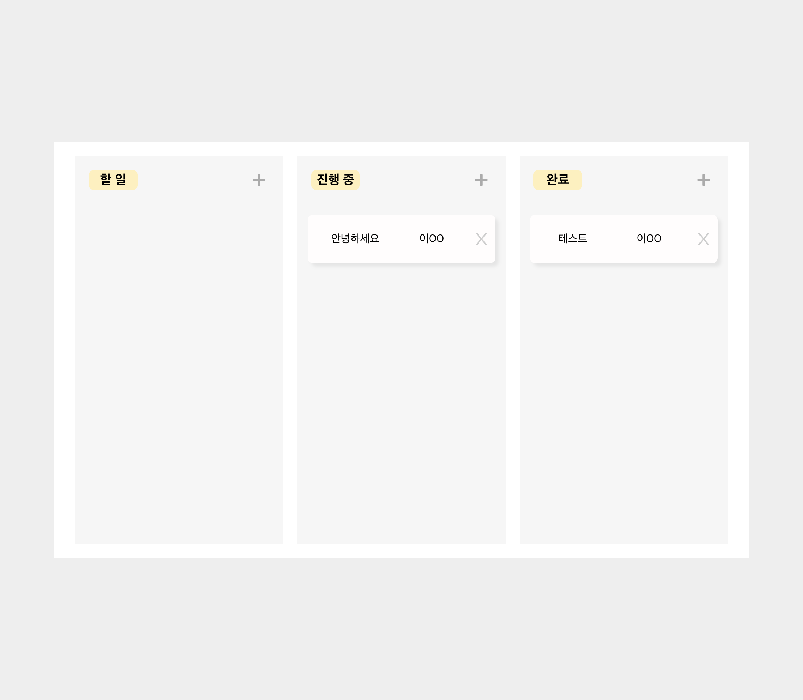
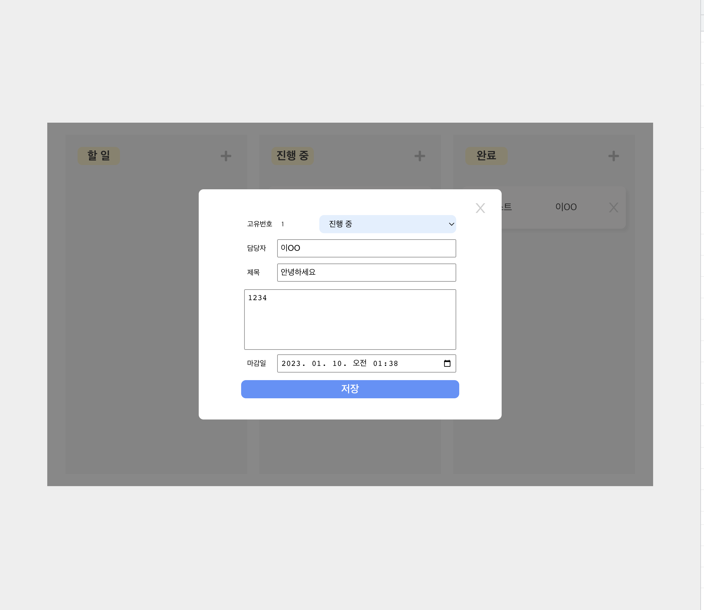

# 원티드 프리온보딩 인턴십 과제 - 이슈 트래킹

## 목표

이슈 트래킹 기능 구현(e.g, Jira, Trello)

  

## 프로젝트 설명

 

`npx create-react-app --template typescript`  

### 1. CRUD 구현

* 이슈 목록 조회 기능
  * 이슈 목록에는 제목과 담당자가 노출됩니다.
* 이슈 추가 기능
  * 각 상태별 리스트에서 새로운 이슈를 등록할 수 있습니다.
  * 이슈에는 고유번호, 제목, 내용, 마감일, 상태, 담당자가 존재합니다.
  * 작성 폼에서는 제목, 내용, 마감일, 상태, 담당자를 입력할 수 있습니다.
  * 담당자의 경우 검색을 수행하면 검색결과 값이 노출되며 그 중 하나를 선택해서 담당자를 지정할 수 있습니다.
  * 모든 입력창에 값을 입력하고, 담당자를 제대로 지정한 경우에만 등록버튼이 활성화 됩니다.
* 이슈 상세 보기 기능 
  * 이슈 목록에서 개별 이슈 클릭 시 상세 보기 모달이 오픈됩니다.
* 이슈 정보 수정 기능
  * 상세 보기 모달에서 내용 수정이 가능합니다.
  * 상세정보 창에서 이슈의 각 정보를 수정할 수 있으며, 저장버튼을 클릭 시 수정한 내용이 반영됩니다.

 

### 2. UX (구현 중)

* 로딩
  * 사용자가 데이터가 로딩 중임을 인식할 수 있도록 UX를 고려
  * 로딩 중에는 액션이 발생하는 것을 방지
  * 실수로 인한 중복 액션을 방지하기 위해 실행 후 0.5초의 딜레이를 적용
* 데이터
  * 새로고침해도 유지될 수 있도록 관리 
  * 로컬 스토리지에 데이터 저장
* 에러
  * 에러 상황을 고려해서 처리
